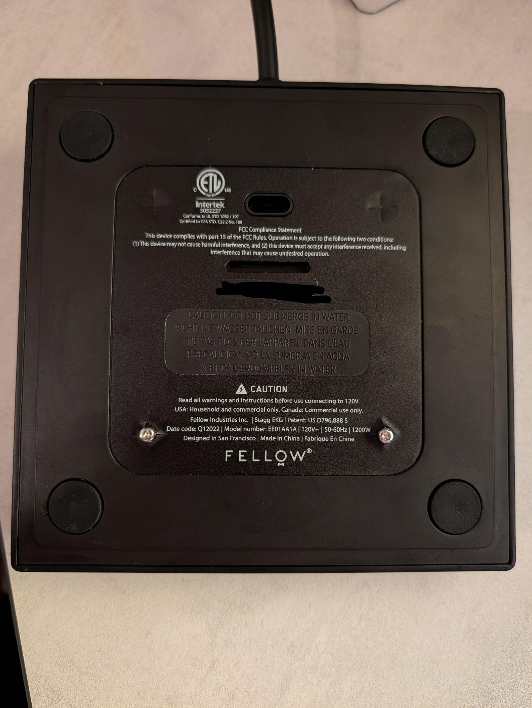
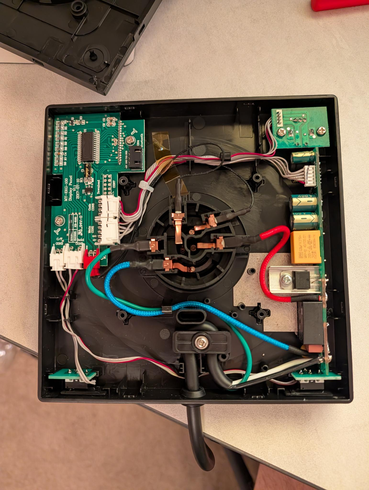

# Info

* **WARNING: +5V DC pin seems to be very low resistance to the hot side of mains power in.**
  Furthermore, you can see 5V DC potential across line/main's hot lead and 0V DC.
  At the very least, you should not connect the +5V DC to your laptop's serial
  to USB adapter.
* The internal serial connector, intended for the optional Bluetooth module,
  operates at 3.3V and 9600 baud no parity.
* It appears to have 1 start bit.
* It sends some kind of status message every 3 seconds.
* The [Stagg EKG+ Manual] mentions `Contains Transmitter - FCC ID: 2AABGBTAC1000`.
* When we search for this FCC ID on FCC.io, https://fcc.io/2AABGBTAC1000,
  we see mention of `EnzyTek Technoloy Inc.` for a part 15C in the 2.4GHz range and a link to the [EnzyTek BTA-C1000-2 Datasheet/Manual].
* From that module datasheet, it appear that the actual Radio MCU is called
  the `CSR CSR1000`. I found the [CSR CSR100 Datasheet].
* Qualcomm acquired CSR (Cambridge Silicon Radio) in 2014.
  Now there is a [Qualcomm CSR101x Series].
* The onboard MCU that controls the kettle and display is a `Cmsemicon CMS80F2618` `2105CNT`
  - https://www.changitech.com/uploads/file1/20220722/CMS80F261x_Datasheet_V1.05.pdf
  - Although the chip is marked pretty clearly, the **pinout for the VCC
    and GND don't match**.
* Board: MY-EKG-100 Display Panel V1.1 RSJ305 2017-07010 from RisingStar.cn

[Fellow Stagg EKG Kettle PCB Reverse Engineering Diagram](https://docs.google.com/drawings/d/1spSMMTtEVBVaj6GtIikueuyRw0ZZhn-C_dDxf22F0jw/edit?usp=sharing)




[Stagg EKG+ Manual]: https://ep-shopify.s3.amazonaws.com/related-documents/fellow/ekg%2B/stagg-ekg%2B-manual.pdf
[EnzyTek BTA-C1000-2 Datasheet/Manual]: https://fcc.report/FCC-ID/2AABGBTAC1000/1978486.pdf
[CSR CSR100 Datasheet]: https://pdf.dzsc.com/99999/2013328165148606.pdf
[Qualcomm CSR101x Series]: https://www.qualcomm.com/bluetooth/products/csr101x-series#benefits

# Parts

* UART Connector
  - 4 pin 2.54 mm (0.1 inch)
  - 0.5in wide (outside female side)
  - 0.25in tall
  - 0.28in long
  - [Amazon - 10 Sets Jst Xh 2.54mm 4 Pin Plug Male Connector with 150mm Soft Silicone Wire & XH2.54 4P Female Connector](https://a.co/d/0iIOorKT)
* [SparkFun Qwiic Pocket Development Board - ESP32-C6](https://www.sparkfun.com/sparkfun-qwiic-pocket-development-board-esp32-c6.html)
* [SparkFun Power Meter - ACS37800 (Qwiic)](https://www.sparkfun.com/sparkfun-power-meter-acs37800-qwiic.html)
  - Schematic - https://cdn.sparkfun.com/assets/1/9/f/6/9/Qwiic_Power_Meter-ACS37800_Schematic.pdf
  - Datasheet - https://www.allegromicro.com/-/media/files/datasheets/acs37800-datasheet.pdf?sc_lang=en
* [SparkFun Flexible Qwiic Cable - 200mm](https://www.sparkfun.com/flexible-qwiic-cable-200mm.html)

# References

* https://github.com/levi/stagg-ekg-plus-ha
  - https://github.com/levi/stagg-ekg-plus-ha/issues/6
* https://github.com/tlyakhov/fellow-stagg-ekg-plus

# UART Protocol

This protocol seems similar to the BLE protocol that others have reverse engineered, but the interface is unresponsive to any of the
BLE packets.

All I see is that the display module sends the following packet every 3 seconds. It does not change based on target temperature set point or on/off state.

<details>
<summary>3 Second Heartbeat Packets</summary>

```
EF 0A 00 EF 0A
EF 0A 00 EF 0A
EF 0A 00 EF 0A
EF 0A 00 EF 0A
EF 0A 00 EF 0A
EF 0A 00 EF 0A
EF 0A 00 EF 0A
EF 0A 00 EF 0A
EF 0A 00 EF 0A
EF 0A 00 EF 0A
EF 0A 00 EF 0A
```
</details>

Upon startup, it transmits the following reset message.

<details>
<summary>Startup Message Packet</summary>

```
46 65 6C 6C 6F 77 3A 20 72 65 73 65 74 5F 63 6F 6E 74 72 6F 6C 6C 65 72 0A
```

*Which spells out `Fellow: reset_controller\n`.*
</details>


